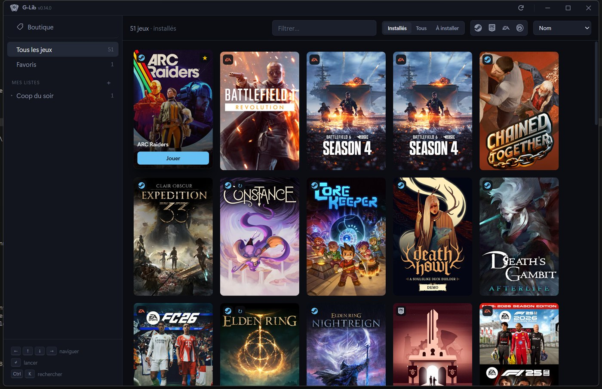
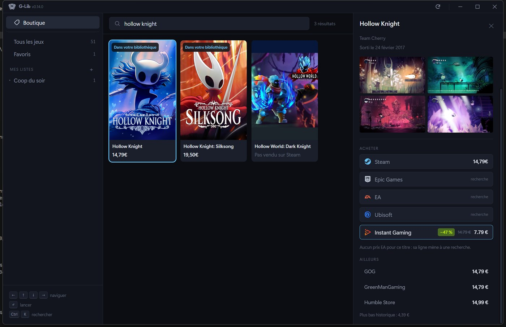
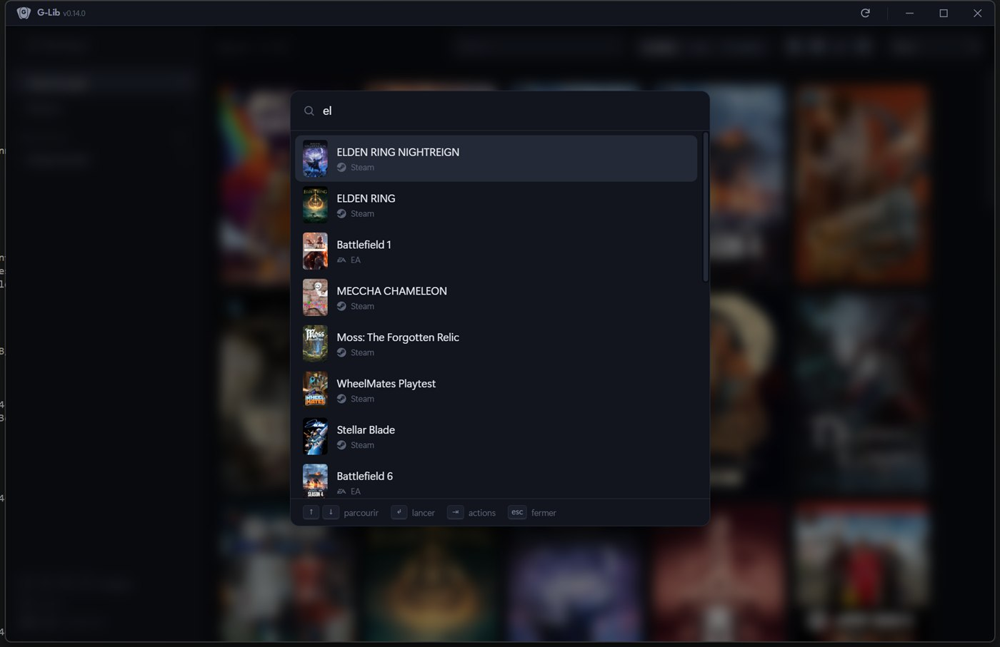

# G-Lib

**Une seule bibliothèque pour tous vos jeux.** Steam, Epic Games, EA et Ubisoft
Connect dans une même grille — lancer, installer ou désinstaller sans ouvrir
quatre launchers.

*[English version](README.md)*



---

## Ce que ça fait

**Trouve vos jeux tout seul.** Tout le scan est local — fichiers et registre
Windows. Aucun login, aucune API propriétaire, aucun token. Les jeux installés
*et* ceux que vous possédez sans les avoir installés.

**Se tient à jour tout seul.** Installez ou supprimez un jeu et sa carte
apparaît ou disparaît ; rien à cliquer.

**Retient ce que vous jouez.** Aucune boutique n'expose le temps de jeu en
local, alors G-Lib mesure le sien en surveillant les processus — dernière
session et temps cumulé, pour les quatre plateformes à l'identique.

**Trouve un jeu à acheter, et où il est le moins cher.**



Le catalogue vient de Steam, étendu par IGDB pour les jeux que Steam ne vend
pas. Les prix viennent d'IsThereAnyDeal — une trentaine de boutiques d'un coup,
avec la remise et le plus bas historique — plus Instant Gaming, qu'aucun
comparateur ne couvre.

**Répond au clavier.** `Ctrl+K` ouvre une palette qui cherche dans toute la
bibliothèque quels que soient les filtres, lance à l'Entrée, et ouvre les
actions du jeu au `Tab`. La grille accepte les flèches ou `hjkl`, `gg`/`G`,
`Ctrl+D`/`Ctrl+U`.



---

## Installer

Téléchargez le dernier `G-Lib_x.y.z_x64-setup.exe` depuis les
[Releases](https://github.com/Corentinjsn/G-Lib/releases) et lancez-le. Windows
uniquement. L'application se met à jour toute seule ensuite.

## Clés optionnelles

G-Lib fonctionne sans aucune d'elles. Chacune ajoute une source, et chacune est
gratuite.

| Clé | Ce qu'elle ajoute | Où l'obtenir |
|---|---|---|
| `%USERPROFILE%\.gamlib\itad.key` | Les prix d'une trentaine de boutiques, remises et plus bas historique | [isthereanydeal.com/apps/my](https://isthereanydeal.com/apps/my/) |
| `%USERPROFILE%\.gamlib\igdb.json` | Les jeux que Steam ne vend pas | [dev.twitch.tv/console/apps](https://dev.twitch.tv/console/apps) |

`igdb.json` contient `{ "clientId": "...", "clientSecret": "..." }`. Les clés
vivent hors du dépôt, délibérément.

## Construire soi-même

Prérequis : [Bun](https://bun.sh), Rust stable, MSVC build tools, WebView2.

```bash
bun install
bun run tauri dev      # lance l'app
bun run tauri build    # produit l'installeur
bun test               # la logique d'affichage
cd src-tauri && cargo test
```

## Comment ça marche

Où chaque launcher cache ses jeux, comment les jaquettes sont trouvées sans clé
d'API, comment le temps de jeu est mesuré, et pourquoi la recherche de prix
refuse une correspondance approximative de titre :
**[la version longue](docs/how-it-works.fr.md)**.

## Construit avec

[Tauri 2](https://tauri.app) · React · TypeScript · Rust · Tailwind CSS · Bun.
Logos des boutiques : [Simple Icons](https://simpleicons.org) (CC0).

Sans affiliation avec Valve, Epic Games, Electronic Arts ou Ubisoft.
